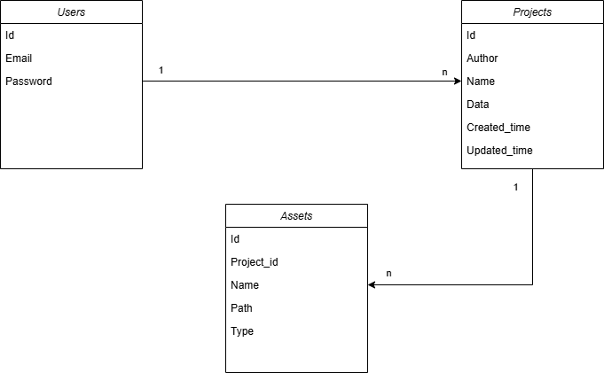
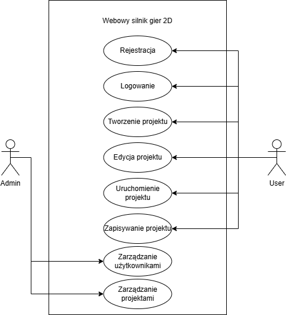

# Webowy silnik gier 2D

Aplikacja webowa umożliwiająca tworzenie prostych gier 2D bezpośrednio w przeglądarce internetowej.  
System udostępnia edytor sceny (mapy), możliwość dodawania obiektów gry oraz uruchamiania projektu w trybie testowym.

Projekt stanowi uproszczony silnik gier działający w środowisku webowym. Użytkownik może tworzyć mapy w oparciu o siatkę tilemap, dodawać elementy świata gry oraz testować działanie gry w czasie rzeczywistym.

## Funkcjonalności

- tworzenie i edycja projektu gry
- edytor map oparty na siatce (tilemap)
- dodawanie obiektów gry (NPC, zdarzenia)
- tryb testowania gry (Play Mode)
- zapisywanie projektu w formacie JSON
- możliwość zapisu projektu w bazie danych

## Struktura projektu

- `/frontend` – aplikacja kliencka (HTML, CSS, JavaScript)
- `/backend` – serwer API (Node.js)
- `/docs` – dokumentacja projektu oraz diagramy systemu

## Technologie

### Frontend
- HTML
- CSS
- JavaScript
- Canvas API

### Backend
- Node.js
- Express

### Baza danych
- PostgreSQL (planowana)

## Diagram ERD

Diagram ERD (Entity Relationship Diagram) przedstawia strukturę bazy danych oraz relacje pomiędzy głównymi encjami systemu.

### Opis encji

**Users**
- przechowuje dane użytkowników systemu
- użytkownik może posiadać wiele projektów gier

**Projects**
- przechowuje projekty gier utworzone przez użytkowników
- zawiera dane projektu zapisane w formacie JSON

**Assets**
- przechowuje zasoby projektu (grafiki, sprite'y, tilesety)
- każdy zasób jest przypisany do konkretnego projektu

### Relacje

- jeden użytkownik może posiadać wiele projektów
- jeden projekt może posiadać wiele zasobów

## Diagram przypadków użycia

Diagram przypadków użycia przedstawia interakcję użytkownika z systemem oraz główne funkcjonalności aplikacji.

### Aktorzy

**User**
- osoba korzystająca z systemu do tworzenia gier

**Admin**
- osoba zarządzająca systemem

### Przypadki użycia

- rejestracja w systemie
- logowanie do systemu
- tworzenie projektu gry
- edycja projektu
- uruchamianie gry
- zapisywanie
- zarządzanie użytkownikami
- zarządzanie projektami

## Uruchomienie projektu

### Backend

1. Przejdź do folderu backend:

cd backend

2. Zainstaluj zależności:

npm install

3. Uruchom serwer:

npm start

### Frontend

Otwórz plik w przeglądarce:

frontend/index.html